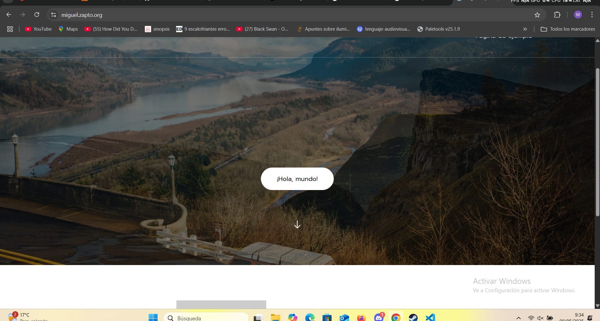
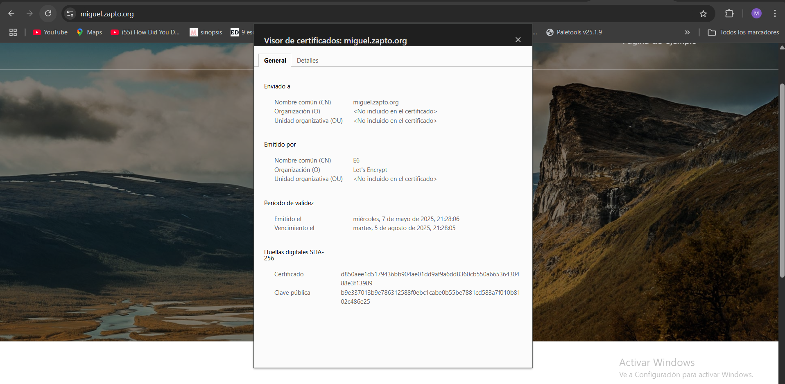

# practica9:Arquitectura de una aplicación web LAMP en dos niveles


En esta practica vamos a realizar la instalacion de wordpress en dos niveles.
Un backend que se encargará de gestionar mysql y un fronted donde se encontrará alojado apache y wordpress.
Sera una práctica parecida a la que ya hicimos con los mismos archivos solo que cambiaremos la instalación de la pila lamp, la fraccionaremos en una parte donde se instalará todo mysql en el backend y en el fronted todo lo demas.Además, usaremos en el fronted lets encrypt para crear nuestro certificado. Por último usaremos dos deploy,uno que istalaremos en el fronted y otro que instalaremos en el backend .

Nota: ambas máquinas funcionan con la ip-privada.

## Instalacion de lamp en máquina backend.

Cogemos las variables

```bash
source .env
```
Configuramos para mostrar los comandos y finalizar si hay error

```bash
set -ex
```
Actualizamos los repositorios

```bash
apt update
```
Actualizamos los paquetes

```bash
apt upgrade -y
```
Instalamos MySQL Server

```bash
apt install mysql-server -y
```
La diferencia de este lamp es que modificaremos las direccion de la  interfaz de red del servidor de MySQL se van a permitir conexiones

```bash
sed -i "s/127.0.0.1/$BACKEND_IP/" /etc/mysql/mysql.conf.d/mysqld.cnf
```

Reiniciamos mysql para que se haga los cambios
```bash
sudo systemctl restart mysql
```
Ahora instalaremos el deploy del backend,para mysql creando la base de datos y dandole permisos a los usuarios.
onfiguramos para mostrar los comandos y finalizar si hay error

```bash
set -ex
```
Importamos el archivo de variables

```bash
source .env
```
Creamos  la base de datos de usuario

```bash
mysql -u root <<< "DROP DATABASE IF EXISTS $WORDPRESS_DB_NAME"
mysql -u root <<< "CREATE DATABASE $WORDPRESS_DB_NAME"
mysql -u root <<< "DROP USER IF EXISTS $WORDPRESS_DB_USER@$FRONTEND_IP"
mysql -u root <<< "CREATE USER $WORDPRESS_DB_USER@$FRONTEND_IP IDENTIFIED BY '$WORDPRESS_DB_PASSWORD'"
mysql -u root <<< "GRANT ALL PRIVILEGES ON $WORDPRESS_DB_NAME.* TO $WORDPRESS_DB_USER@$FRONTEND_IP"
```

Con esto acabamos con la máquina backend.Ahora,nos pondremos con la intalación del fronted.
## Instalación del fronted
Aquí instalaremos el resto de la pila lamp que no hemos instalado,el certificado y la instalación de wp.

Primero instalamos lo que nos falta de lamp.

Configuramos para mostrar los comandos y finalizar si hay error
```bash
set -ex
```
Actualizamos los repositorios
```bash
apt update
```
Actualizamos los paquetes
```bash
apt upgrade -y
```
Instalamos el servidor web Apache
```bash
apt install apache2 -y
```
Habilitamos un módulo rewrite
```bash
a2enmod rewrite
```
Copiamos el arhcivo de configuracion de Apache
```bash
cp ../conf/000-default.conf /etc/apache2/sites-available
```
Instalamos PHP y algunos modulos de PHP para Apache y MySQL
```bash
apt install php libapache2-mod-php php-mysql -y
```
Reiniciamos el servicio de Apache
```bash
systemctl restart apache2
```
Copiamos el script de prueba de PHP en /var/www/html
```bash
cp ../php/index.php /var/www/html
```
Modificar el propietario y el grupo
```bash
chown -R www-data:www-data /var/www/html
```
A continuación instalamos nuestro certificado:

Configuramos para mostrar los comandos y finalizar si hay error
```bash
set -ex
```

Importamos el archivo de variables

```bash
source .env
```
El proveedor de donimnio sera no-ip

Instalamos y actualizamos snap

```bash
snap install core
snap refresh core
```
Eliminamos instalaciones previas de cerbot con apt

```bash
apt remove certbot -y
```
Instalamos Certbot

```bash
snap install --classic certbot
```
Solicitamos un cerficado a Let`s Encrypt

```bash
sudo certbot --apache -m $LE_EMAIL --agree-tos --no-eff-email -d $LE_DOMAIN --non-interactive
```

Por útimo, instalaremos wp.
Configuramos para mostrar los comandos y finalizar si hay error
```bash
set -ex
```
Importamos el archivo de variables
```bash
source .env
```
Borramos intalaciones previas

```bash
rm -rf /tmp/wp-cli.phar*
```
Descargamos el WP-CLI , tambien se puede descargar con curl -o, la ruta /opt como lo vamos a usar mas de una vez , en caso de usarlo solo una vez es mejor en /tmp

```bash
wget https://raw.githubusercontent.com/wp-cli/builds/gh-pages/phar/wp-cli.phar -P /tmp
```
Le asignamos permisos de ejecucion

```bash
chmod +x /tmp/wp-cli.phar
```

Lo movemos con en los comandos locales /usr/local/bin y le asignamos un nombre mas corto, asi no tenemos que poner toda la ruta /tmp/wp-cli.phar

```bash
mv /tmp/wp-cli.phar /usr/local/bin/wp

rm -rf $WORDPRESS_DIRECTORY/*
```
Instalamos el codigo fuente, en español , en la ruta /var/www/html , y que se pueda ejercutar como root

```bash
wp core download --locale=es_ES --path=$WORDPRESS_DIRECTORY --allow-root
```
Creamos el archivo de configuracion

```bash
wp config create --dbname=$WORDPRESS_DB_NAME --dbuser=$WORDPRESS_DB_USER --dbpass=$WORDPRESS_DB_PASSWORD --dbhost=$BACKEND_IP --path=$WORDPRESS_DIRECTORY --allow-root
```
Instalamos el Worpres con el titulo y el usuario

```bash
wp core install --url=$LE_DOMAIN --title=$WORDPRESS_TITULO --admin_user=$WORDPRESS_USER --admin_password=$WORDPRESS_PASSWORD --admin_email=$LE_EMAIL --path=$WORDPRESS_DIRECTORY --allow-root  
```
 Cambiamos los permisos de root a www-data

```bash
chown www-data:www-data /var/www/html/*
```
Instalamos un tema

```bash
wp theme install mindscape --activate --path=$WORDPRESS_DIRECTORY --allow-root
```
Configuramos los enlaces 

```bash
wp rewrite structure '/%postname%/' --path=$WORDPRESS_DIRECTORY --allow-root
```
 Instalamos un plugin para que oculte el inicio de sesion

```bash
wp plugin install wps-hide-login --activate --path=$WORDPRESS_DIRECTORY --allow-root
```
Configuramos el plugin 

```bash
wp option update whl_page "$WORDPRESS_HIDE_LOGIN_URL" --path=$WORDPRESS_DIRECTORY --allow-root
```
Copiamos el archivo .htaccess

```bash
cp ../htaccess/.htaccess $WORDPRESS_DIRECTORY
```
Configuramos la variable $_SERVER['HTTPS'] , para que cargen las hojas de estilo CSS

```bash
sed -i "/COLLATE/a \$_SERVER['HTTPS'] = 'on';" /var/www/html/wp-config.php
```

Cambiamos los permisos de root a www-data

```bash
chown www-data:www-data /var/www/html/*
```

## Comprobaciones

Acceso a wordpress


Comprobación de nuestro certificado
